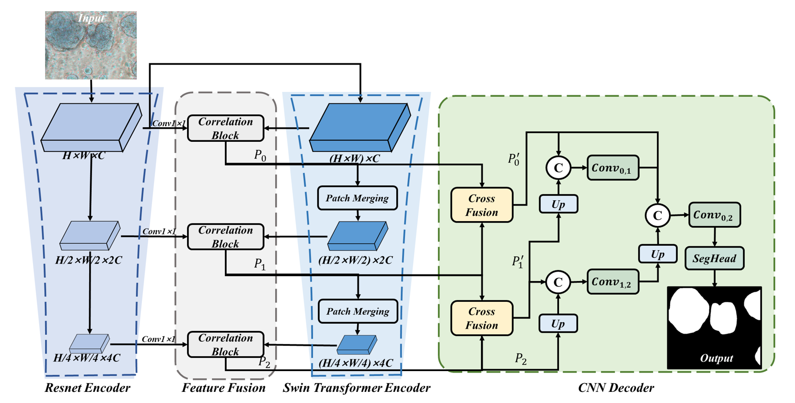
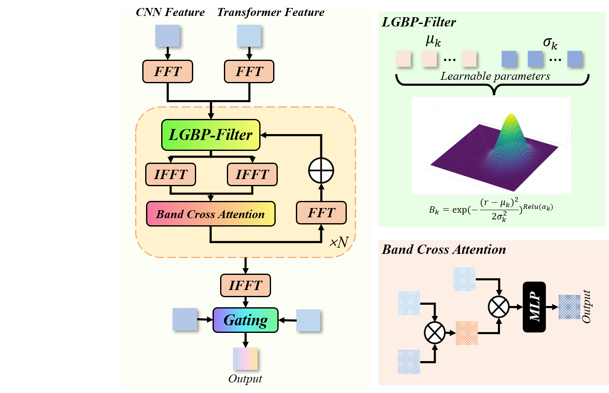
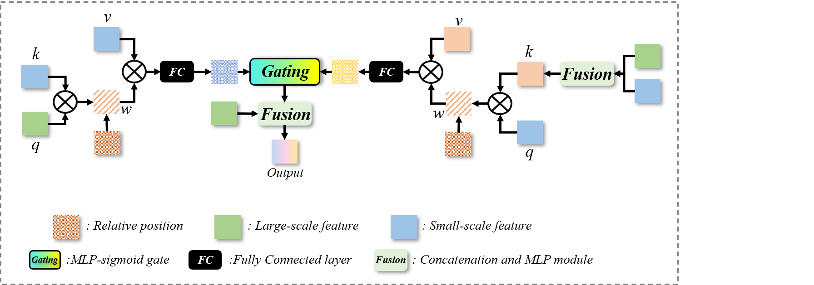

# LGBP-OrgaNet

> **LGBP-OrgaNet: Organoid Segmentation and Tracking via Learnable Gaussian Band-Pass Fusion and Bidirectional Cross-Scale Attention**  

This repository provides the official implementation of **LGBP-OrgaNet**, a hybrid CNN–Transformer framework designed for **organoid segmentation and tracking**.  
Our method integrates CNN-derived local textures and Transformer-based global semantics through **Learnable Gaussian Band-Pass Fusion (LGBP-Fusion)** and enhances cross-scale information exchange via a **Bidirectional Cross Fusion Block (BCF)**.  

---

## 🏗️ Model Architecture

<p align="center">
  
</p>


The network is composed of:
- **Dual-branch Encoder** combining ResNet and Swin Transformer.  
- **LGBP-Fusion**: adaptive frequency-band decomposition and band-wise self-attention fusion.  
- **Bidirectional Cross Fusion Block (BCF)**: bidirectional self-attention and adaptive gating across scales.  
- **Progressive Decoder** with multi-scale concatenation and upsampling for robust segmentation and tracking.  

---

## 🔬 Key Contributions

- **LGBP-Fusion**
- <p align="center">
  
</p>

  - Decomposes CNN and Transformer features into multiple **adaptive Gaussian frequency bands**.  
  - Performs band-wise self-attention fusion, effectively combining textures and semantics.  
  - Reduces cross-modal interference and improves interpretability.  

- **Bidirectional Cross Fusion Block (BCF)**
- <p align="center">
  
</p>
  - Employs **bidirectional self-attention** between high-resolution and low-resolution features.  
  - Adaptive gating balances fine-grained detail enhancement and semantic context refinement.  

- **Robustness across datasets**  
  - Validated on three organoid datasets (mice bladder, mammary epithelial, brain organoids).  
  - Outperforms UNet, TransUNet, OrganoID, and TransOrga.  

---

## 📂 Dataset

1. **Mice Bladder Organoid Dataset (self-constructed)**  
   - First bladder cancer organoid dataset with **complex backgrounds**.  

2. **Mammary Epithelial Organoid Dataset**  
Hradecká L, Wiesner D, Sumbal J, et al. Segmentation and tracking of mammary epithelial organoids in brightfield microscopy[J]. IEEE Transactions on Medical Imaging, 2022, 42(1): 281-290.
3. **Brain Organoid Dataset**    
Schröter J, Deininger L, Lupse B, et al. A large and diverse brain organoid dataset of 1,400 cross-laboratory images of 64 trackable brain organoids[J]. Scientific Data, 2024, 11(1): 514.
---

## ⚙️ Requirements

- Python >= 3.8  
- PyTorch >= 1.11  
- CUDA >= 11.0  
- Dependencies:  
  ```bash
  pip install -r requirements.txt
